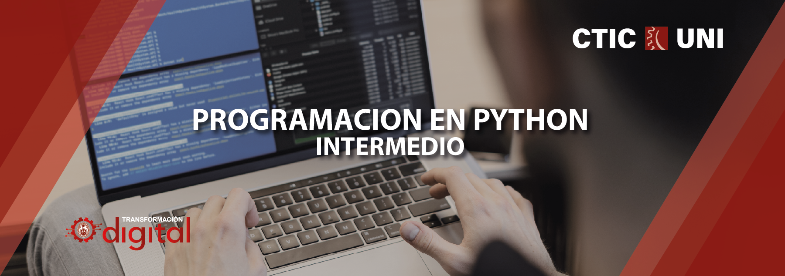

# Curso de Python Intermedio - OTI - UNI 

La enseñanza de la programación en niveles educativos universitarios
desarrolla en los alumnos capacidades fundamentales para sus estudios
futuros y/o su vida laboral, como encarar procesos de búsqueda y
corrección de errores, resolución de problemas complejos o el
desarrollo del pensamiento computacional. Además, el mercado
laboral/académico cada vez demanda más profesionales altamente
capacitados en el ámbito de la programación.

## Información general 
- *Modalidad virtual*
- *Duración de 8 sesiones*
- *16 horas*

## ¿Qué aprenderas en el curso?
El objetivo del curso es la aplicación de python en el manejo de métodos
numéricos aplicados a ingeniería, así como también los aspectos
principales de la programación orientada a objetos.

Al finalizar con éxito este curso, podrá aplicar python a un numero
bastante grande de necesidades.

## Dirigido a 
Este curso está dirigido a alumnos de pregrado de todas las universidades.

## Temario del curso 

### Módulo 1
- *1.- Manejo de Errores y Excepciones*
- *2.- Sentencia raise*
- *3.- Sentencias : Try & Except*
- *4.- Uso de assert*
- *5.- Definiendo excepciones*

### Módulo 2 
- *1.- Métodos Numéricos*
	-*1.1.- Álgebra Lineal*
	-*1.2.- Interpolación*
	-*1.3.- Cálculo de raíces*
	-*1.4.- Derivación e Integración numérica*

### Módulo 3
- *1.- Programación Orientada a objetos*
- *2.- Tipos de datos abstractos y clases*
- *3.- Instancias*
- *4.- Abstracción*
- *5.- Encapsulación*
- *6.- Herencia*
- *7.- Polimorfismo*

## Docente 
*Abraham Zamudio Chauca* 

Docente en la Oficina de tecnologías de la información de la
Universidad Nacional de Ingeniería - OTI UNI.

Egresado de la carrera de Matemática de la Universidad
Nacional de Ingeniería con experiencia en la construcción de
sistemas de procesamiento distribuido, despliegue de
soluciones informáticas en entornos Linux y desarrollo de
software usando técnicas de machine learning y deep
learning para entornos comerciales y de investigación.

